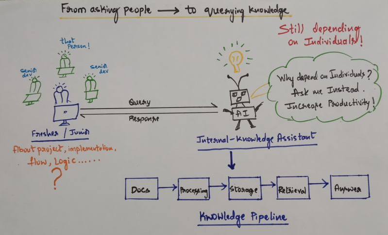

# AI Internal Knowledge Assistant


## Concept Overview


Treat internal engineering knowledge as something that can be **queried instantly, not hunted manually or extracted from individuals**.

Modern software teams invest significant effort in documentation — architecture notes, runbooks, code comments, and onboarding guides.

Yet when a developer needs an answer quickly, the most common response is still:

**“Ask that person.”**

Important engineering knowledge often lives inside individuals rather than systems.

This project explores a different idea:

> **What if internal project knowledge could be queried instead of searched manually or asked from individuals?**

The **AI Internal Knowledge Assistant** is an experimental system designed to make project knowledge easier to discover, understand, and reuse by allowing developers to ask questions about internal documentation and receive contextual answers.

---

## The Problem

In many engineering teams:

* Important implementation knowledge exists but is difficult to retrieve quickly
* Documentation is scattered across multiple tools and repositories
* Developers frequently interrupt teammates to understand existing systems
* New developers spend significant time understanding architecture and workflows

Typical workflow today:

```
Developer Question
      ↓
Search Documentation
      ↓
Search Codebase
      ↓
Ask Teammate
      ↓
Wait for Response
```

This creates:

* Knowledge silos
* Onboarding friction
* Unnecessary context switching

---

## The Idea

Instead of manually searching documentation or relying on specific individuals, internal knowledge should be **queryable**.

Example:

Developer question:

```
Where is the authentication logic implemented?
```

Assistant response:

```
Authentication is implemented in the AuthService module.
Token validation occurs inside JwtAuthenticationFilter.
```

The goal is **not to add AI for the sake of it**, but to improve **knowledge accessibility inside engineering teams**.

---

## Solution Overview

The system uses a **Retrieval-Augmented Generation (RAG)** architecture.



Internal documents are processed into semantic embeddings and stored in a vector database. When a question is asked, relevant information is retrieved and passed to an LLM to generate a contextual answer.

Processing pipeline:

```
Upload Document
      ↓
Text Extraction
      ↓
Chunking
      ↓
Embedding Generation
      ↓
Vector Database (pgvector)
      ↓
Semantic Retrieval
      ↓
AI Generated Answer
```

---

## RAG Architecture Layers

The system follows a **three-layer Retrieval-Augmented Generation (RAG) architecture**: knowledge ingestion, retrieval, and answer generation.

This design ensures that responses are **grounded in internal documents rather than relying solely on LLM knowledge**.

### 1. Knowledge Ingestion Layer

This layer builds the internal knowledge base by converting documents into searchable vector representations.

```
Document Upload
      ↓
Text Extraction
      ↓
Chunking
      ↓
Embedding Generation
      ↓
Vector Storage (pgvector)
```

Key steps:

- **Document Upload** – Users upload documents such as PDFs, DOCX files, or technical guides.
- **Text Extraction** – Plain text is extracted using appropriate parsers (PDF parser, Apache POI, etc).
- **Chunking** – Documents are split into smaller chunks (~500 tokens with overlap) to preserve semantic meaning.
- **Embedding Generation** – Each chunk is converted into a vector embedding using the OpenAI embedding model.
- **Vector Storage** – Embeddings are stored in **PostgreSQL with pgvector** to enable semantic similarity search.

---

### 2. Knowledge Retrieval Layer

When a user asks a question, the system retrieves relevant knowledge using semantic vector search.

```
User Question
      ↓
Query Embedding
      ↓
Vector Similarity Search
      ↓
Retrieve Relevant Chunks
```

The user query is converted into an embedding and compared against stored document vectors to find the most relevant information.

Example conceptual query:

```sql
SELECT chunk_text
FROM document_chunks
ORDER BY embedding <-> query_embedding
LIMIT 5;
```

---

### 3. Answer Generation Layer

The retrieved document context is combined with the user question and sent to the LLM.

```
Retrieved Context
      +
User Question
      ↓
LLM (DeepSeek Chat Model)
      ↓
Generated Answer
```

The LLM generates a response **grounded in retrieved internal documents**, reducing hallucinations and ensuring answers remain context-aware.

---

## System Architecture

The backend is organized into modular components:

```
config
document
storage
ingestion
extraction
chunking
embedding
vectorstore
chat
```

### Document Ingestion Flow

```
Upload Document
      ↓
Extraction
      ↓
Chunking
      ↓
Embedding
      ↓
Vector Storage
```

### Query Flow

```
User Question
      ↓
Query Embedding
      ↓
Vector Similarity Search
      ↓
Retrieve Relevant Context
      ↓
LLM Response Generation
```

---

## Scalable Architecture (Planned)

To support large document ingestion workloads, the system will evolve into an asynchronous architecture:

```
Upload
  ↓
MinIO Storage
  ↓
RabbitMQ Queue
  ↓
Ingestion Worker
  ↓
Extraction → Chunking → Embedding → Vector Database
```

This allows document processing to run in the background while keeping user interactions fast.

---

## Example Interaction

**User Question**

```
Where is the authentication logic implemented?
```

**Assistant Response**

```
Authentication is implemented in the AuthService module.
Token validation occurs inside JwtAuthenticationFilter.
```

The response is generated using **retrieved context from internal documents**, ensuring answers remain grounded in project knowledge.

---

## Tech Stack

### Backend

* Java 17
* Spring Boot
* Spring AI

### AI and NLP

* OpenAI Embeddings (`text-embedding-3-large`)
* DeepSeek Chat Model

### Database

* PostgreSQL
* pgvector extension

### Infrastructure

* Docker

### Frontend (Planned)

* React

---

## Why This Project Matters

This project focuses on solving a practical engineering problem:

* Reduce dependency on individuals for project knowledge
* Improve developer onboarding speed
* Minimize repeated context switching
* Make technical knowledge easier to retrieve and reuse

Although the current focus is **engineering knowledge retrieval**, the architecture can evolve into a broader **organization-wide knowledge assistant**.

---

## Development Status

The core backend architecture and document ingestion pipeline have been successfully implemented.

The system currently supports document processing, chunking, and vector storage, forming the foundation of a Retrieval-Augmented Generation (RAG) pipeline.

End-to-end validation of the pipeline — including embedding generation, semantic retrieval, and LLM-based response generation — is actively in progress.

---

## Current Focus

- Integrating OpenAI embeddings for accurate semantic representation
- Validating vector storage and similarity search using pgvector
- Implementing retrieval flow and context-aware RAG-based question answering
- Ensuring response grounding to minimize hallucinations

---

## Upcoming Improvements

- React-based chat interface for real-time interaction
- Asynchronous document ingestion using RabbitMQ
- Scalable document storage using MinIO
- Streaming responses for improved user experience
- Authentication and access control (Spring Security)

---

This project is being developed with a focus on production-grade architecture, modular design, and real-world applicability in engineering teams.

## Author

**Rakshith SR**
Full Stack Developer | Backend Engineering | AI Systems
